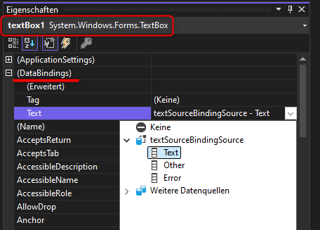

# BindingDemo

Grundlegendes Beispiel, wie man ohne großes Trara Datenbindung *und* Validierung 
im Datenobjekt bewerkstelligt.

Alles Klickibunti, bis auf die `TextSource` Klasse und wenige Zeilen in `Form1.cs`.

Knackpunkte:
* Implementierung von INotifyPropertyChanged
* Implementierung von IDataErrorInfo
* Datenbindung über Dialog an Klasse:  
  
* Tatsächliches Setzen einer Instanz des entsprechenden Typs